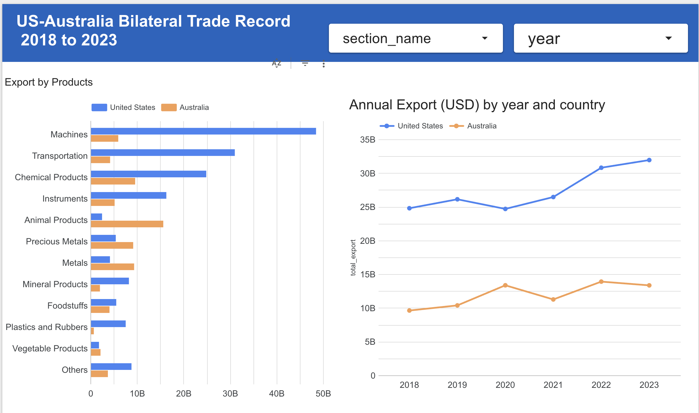

## 📊 Project Overview

This project aims to present the **bilateral trade records between the United States and Australia** over the past several years, with a focus on how recent **tariff policies** may have influenced trade dynamics. Specifically, it analyzes:

- **U.S. exports to Australia**  
- **Australian exports to the U.S.**

The dataset spans from **2018 to 2023** and covers various **sections of products**, offering a comprehensive view of trade volume trends and shifts in product categories. The pipeline ingests, transforms, and stores this data for exploration and dashboard visualization.

## 🌍 Yearly Export Data Ingestion Pipeline

This project implements a **yearly scheduled ETL pipeline** using **PySpark** and **Google Cloud Platform (GCP)** to process trade export data. The pipeline reads raw data from **GCS**, transforms it with **PySpark**, loads it into **BigQuery**, and visualizes it in **Looker Studio**.

### 📐 Architecture Diagram

### 🚀 Tech Stack

- **Google Cloud Platform (GCP)**: GCS, BigQuery, Dataproc
- **Apache Spark (PySpark)**: Data processing
- **Kestra**: Workflow orchestration (local option)
- **Terraform**: Infrastructure provisioning
- **Looker Studio**: Data visualization

## 🏗️ Infrastructure Setup with Terraform

Before executing the pipeline, required GCP infrastructure (bucket and dataset) is provisioned using **Terraform**. This includes:

- A GCS bucket to store CSV files and JARs
- A BigQuery dataset for output tables

Make sure to configure project credentials and service account access in your Terraform variables before applying.

## ⚙️ Data Ingestion Pipeline

The PySpark script performs the following:

- Reads raw CSV files from GCS
- Infers schema and cleans the data
- Writes processed data to BigQuery as fact and dimension tables

JARs for GCS and BigQuery support are included in the runtime configuration.

## 📆 Workflow Scheduling

### Option A: **Local Development with Kestra + Docker**

- Kestra handles orchestration and scheduling using a YAML-defined workflow
- Dockerized execution enables reproducibility on local machines
- The pipeline is scheduled to run **once a year** (January 1st, 00:00 UTC)

### Option B: **Production-Grade Orchestration with Dataproc + Cloud Scheduler**

- Uses **Dataproc Serverless** to run the Spark job without managing clusters
- Scheduled via **Cloud Scheduler**
- Triggers a **Dataproc batch job** that executes the PySpark script in GCS

No need to manage or recreate clusters manually.

## 📊 Final Dashboard

An interactive dashboard is built in **Looker Studio** to present trade statistics and insights.

### Preview

👉 [**Click here to view the dashboard**](https://lookerstudio.google.com/reporting/7de40f33-62e0-48fd-9a71-e535162e0714)

## ✅ To-Do

- Add data validation (e.g., Great Expectations)
- Integrate GitHub Actions for CI/CD
- Add pipeline monitoring with GCP tools

---

Let me know if you'd like this turned into an actual `README.md` file or converted into another format like PDF.