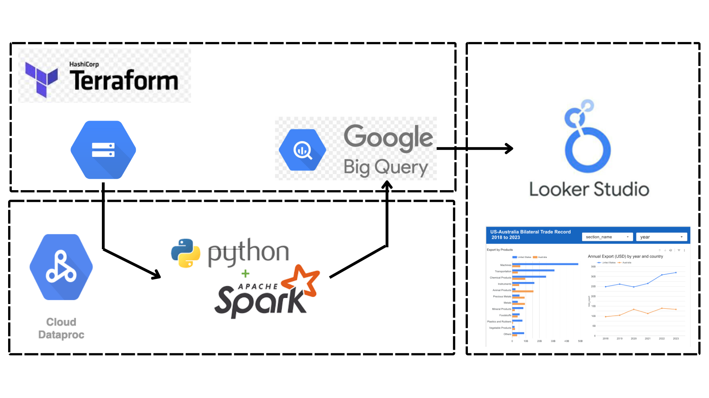

# Data Engineering Zoomcamp

## Overview

This repository contains coursework and lab exercises for the Data Engineering Zoomcamp. It includes modules for containerization, workflow orchestration, data warehousing, analytics engineering with dbt, batch Spark processing, streaming with PyFlink, and a final Google Cloud project.

## Repository structure

- `01_docker_teeraform/` - Docker, Terraform, SQL exercises, and ingestion notebooks.
- `02-workflow-orchestration/` - Workflow definitions and orchestration examples.
- `03-data-warehouse/` - SQL homework for data warehouse design and analysis.
- `04-analytics-engineering/` - dbt project with staging, core models, seeds, macros, and tests.
- `05-batch/` - Spark batch examples and notebooks.
- `06-streaming/` - PyFlink streaming jobs, Kafka producers, and Docker setup.
- `07-project/` - Google Cloud infrastructure, Terraform scripts, scheduling helpers, and raw data assets.

## Key components

### 01_docker_teeraform
- `Dockerfile` for containerized ingestion.
- `data_ingestion.ipynb` for pipeline demonstration.
- SQL analysis files: `count_trips_by_distance.sql`, `largest_tip.sql`, `top_3_pickup_zones.sql`.
- Sample lookup data under `ny_taxi_postgres_data/`.

### 02-workflow-orchestration
- `docker-compose.yaml` for local orchestration.
- `flows/` contains workflow definitions for GCP and taxi pipelines.

### 03-data-warehouse
- `homework.sql` with warehouse-focused ETL and analytics exercises.

### 04-analytics-engineering
- `ny-taxi-dbt/` contains a dbt analytics project.
- Staging and core models, seeds, macros, snapshots, and tests.

### 05-batch
- `Spark_in_Colab.ipynb` for Spark batch processing examples.

### 06-streaming
- `pyflink/` contains streaming job code and producer scripts.
- `docker-compose.yml` and `Dockerfile.flink` support local development.

### 07-project
- Terraform scripts for Google Cloud infrastructure.
- `gcloud_scheduling.sh` and `gcloud_submit.sh` for deployment and scheduling.
- Raw dataset examples and ingestion script in `scripts/`.

#### Project workflow
[](07-project/README.md)

## Contributing

- Keep new scripts and notebooks within the appropriate module folder.
- Add documentation when introducing new workflows or architecture.
- Use clear commit messages and descriptive branch names.

## License

No license file is included in this repository. Confirm reuse permissions with the project owner before sharing or redistributing code.
## Getting started

### Prerequisites
- Docker
- Docker Compose
- Python 3.10+ (or compatible environment)
- dbt Core
- Terraform
- Google Cloud SDK

### Quick start

```bash
git clone <repo-url>
cd data-engineering-zoomcamp
```

Then open the module you want to work with:
- dbt: `cd 04-analytics-engineering/ny-taxi-dbt`
- streaming: `cd 06-streaming/pyflink`
- project infrastructure: `cd 07-project`

### Example dbt commands

```bash
cd 04-analytics-engineering/ny-taxi-dbt
dbt debug
dbt seed
dbt run
dbt test
```

### Example streaming commands

```bash
cd 06-streaming/pyflink
docker compose up -d
```

## Notes

- This repository is primarily a learning and lab environment with stan